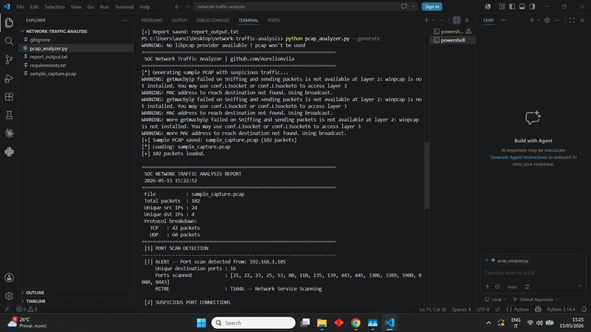
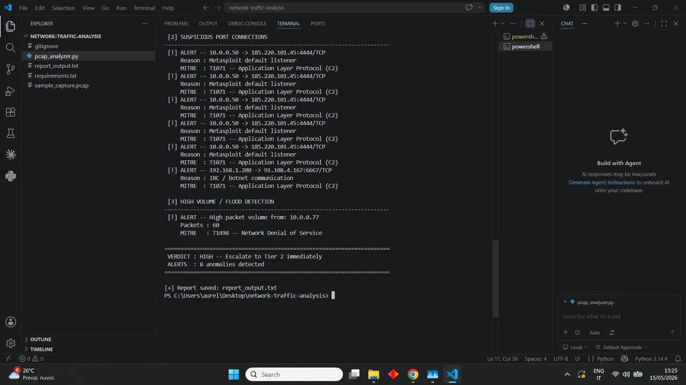

# Network Traffic Analysis — SOC Home Lab

A Tier 1 SOC analyst workflow for analyzing network packet captures (PCAP),
detecting suspicious traffic patterns, and generating structured incident reports
— with both fixed-threshold rules and statistical baseline anomaly detection.

> **Note:** This is a home-lab portfolio project. The sample PCAP is generated
> synthetically for demonstration purposes.

---

## Scenario

A suspicious traffic alert was raised on the network. The analyst performs
a full packet capture analysis to identify:

- Active port scans against internal hosts
- Connections to known malicious or suspicious ports (C2 channels)
- High-volume UDP floods indicating potential DoS activity
- Statistical deviations from this specific network's normal traffic pattern

## Why fixed thresholds aren't enough

A rule like "50+ packets from one IP = flood" only works for the network it
was tuned on. On a busy segment it drowns Tier 1 in false positives; on a
quiet one, an attacker who stays just under the number gets through clean.
This project runs both approaches side by side: fixed thresholds for
deterministic, explainable rules, and an optional statistical baseline
(z-score against this network's own observed normal) for the traffic
patterns a fixed number can't adapt to. See
[`demo_baseline_vs_fixed.py`](demo_baseline_vs_fixed.py) for a reproducible
case where this actually changes the verdict.

## Workflow

1. Generate or load a PCAP file with network traffic
2. Parse all packets and extract source/destination IPs, ports, and protocols
3. Apply fixed-threshold detection: port scan, suspicious ports, high-volume flood
4. *(optional)* Apply statistical anomaly detection against a baseline profile built from known-normal traffic
5. Enrich findings with MITRE ATT&CK technique mapping
6. Produce a structured verdict report

---

## 🎯 MITRE ATT&CK Mapping

| Technique | ID | Tactic |
|-----------|-----|--------|
| Network Service Scanning | [T1046](https://attack.mitre.org/techniques/T1046/) | Discovery (TA0007) |
| Application Layer Protocol (C2) | [T1071](https://attack.mitre.org/techniques/T1071/) | Command and Control (TA0011) |
| Network Denial of Service | [T1498](https://attack.mitre.org/techniques/T1498/) | Impact (TA0040) |

---

## Tools

- **Python 3** — packet parsing and detection logic
- **Scapy** — PCAP generation and analysis
- **argparse** — CLI interface
- **statistics** (stdlib) — baseline mean/stdev and z-score computation

## Detection Logic

**Fixed-threshold rules** (`pcap_analyzer.py`, always on):

- **Port scan:** flags any source IP hitting 10+ unique destination ports → T1046
- **Suspicious ports:** monitors connections to known malicious ports —
  `4444` (Metasploit), `1337` (backdoor), `6667` (IRC/botnet), `6666`,
  `31337`, `9001` (Tor), `9050` (Tor SOCKS), `8888` (C2) → T1071
- **High volume / flood:** flags any source IP sending 50+ packets → T1498

**Statistical baseline mode** (`baseline_profile.py`, opt-in via `--baseline`):

- Builds a per-network profile (mean + standard deviation of packets-per-host
  and unique-ports-per-host) from a known-normal traffic capture
- Flags any host whose packet volume or port diversity is **3+ standard
  deviations** above that network's own baseline mean — instead of a number
  that happened to work on a different network
- Runs *alongside* the fixed rules, not instead of them — deterministic
  rules stay auditable; the baseline catches what they structurally can't

## Repository Structure

    network-traffic-analysis/
    ├── pcap_analyzer.py           # main analysis: fixed-threshold + baseline modes
    ├── baseline_profile.py        # builds a statistical traffic baseline (mean/stdev, z-score)
    ├── demo_baseline_vs_fixed.py  # reproducible proof: a flood the fixed threshold misses
    ├── sample_capture.pcap        # synthetically generated suspicious traffic
    ├── report_output.txt          # sample report output
    ├── requirements.txt           # Python dependencies
    ├── .gitignore
    └── README.md

## Setup

### 1. Clone the repository

```bash
git clone https://github.com/AurelioAvila/network-traffic-analysis.git
cd network-traffic-analysis
```

### 2. Install dependencies

```bash
python -m pip install scapy
```

### 3. Generate sample PCAP and analyze (fixed-threshold mode)

```bash
python pcap_analyzer.py --generate
```

### 4. Analyze with statistical baseline detection

```bash
# Build a baseline profile from known-normal traffic (or your own capture)
python baseline_profile.py --generate

# Analyze with both fixed rules and baseline anomaly detection
python pcap_analyzer.py sample_capture.pcap --baseline
```

### 5. See the fixed-threshold blind spot for yourself

```bash
python demo_baseline_vs_fixed.py
```

Builds a quiet-network baseline and a flood capped deliberately under the
fixed 50-packet threshold, runs both detection modes against it, and prints
the verdicts side by side.

### 6. Analyze your own PCAP / custom output file

```bash
python pcap_analyzer.py your_capture.pcap --baseline my_baseline.json --output my_report.txt
```

---

## 📸 Screenshots

**Part 1 — Traffic summary and port scan detection:**


**Part 2 — C2 connections, flood detection and verdict:**


---

## Sample Output

```
======================================================================
 SOC NETWORK TRAFFIC ANALYSIS REPORT
 2026-05-15 15:22:52
======================================================================
 File           : sample_capture.pcap
 Total packets  : 102
 Unique src IPs : 24
 Unique dst IPs : 4
 Protocol breakdown:
   TCP   : 42 packets
   UDP   : 60 packets
======================================================================
 [1] PORT SCAN DETECTION
----------------------------------------------------------------------
 [!] ALERT -- Port scan detected from: 192.168.1.105
     Unique destination ports : 16
     Ports scanned            : [21, 22, 23, 25, 53, 80, 110, 135, 139, 443, 445, 3306, 3389, 5900, 8080, 8443]
     MITRE                    : T1046 -- Network Service Scanning

 [2] SUSPICIOUS PORT CONNECTIONS
----------------------------------------------------------------------
 [!] ALERT -- 10.0.0.50 -> 185.220.101.45:4444/TCP
     Reason : Metasploit default listener
     MITRE  : T1071 -- Application Layer Protocol (C2)
 [!] ALERT -- 192.168.1.200 -> 91.108.4.167:6667/TCP
     Reason : IRC / botnet communication
     MITRE  : T1071 -- Application Layer Protocol (C2)

 [3] HIGH VOLUME / FLOOD DETECTION
----------------------------------------------------------------------
 [!] ALERT -- High packet volume from: 10.0.0.77
     Packets : 60
     MITRE   : T1498 -- Network Denial of Service
======================================================================
 VERDICT : HIGH -- Escalate to Tier 2 immediately
 ALERTS  : 8 anomalies detected
======================================================================
```

---

## Proof: what the baseline catches that the fixed threshold misses

Real output from `demo_baseline_vs_fixed.py`:

```
[*] Quiet-office baseline: mean 5.65 packets/host, stdev 1.73
[*] Stealthy flood capture: attacker sends 35 packets (fixed threshold triggers at 50)

----------------------------------------------------------------------
 RESULT
----------------------------------------------------------------------
 Fixed-threshold mode  -> high_volume_ips flagged: 0  (needs >= 50 packets, attacker sent 35)
 Baseline mode         -> anomaly_flood_ips flagged: 1
   192.168.2.250: 35 packets, z-score 16.97

[+] Confirmed: the fixed threshold missed this flood entirely.
    The baseline flagged it because it's tuned to *this* network's
    actual normal traffic, not a number that happened to work elsewhere.
```

On this quiet network, normal hosts send ~5-6 packets. An attacker sending
35 — comfortably under the fixed 50-packet rule — is over 16 standard
deviations above what's normal *here*. The fixed rule was silent. The
baseline wasn't.

## Limitations of the baseline approach

- Needs a genuinely clean baseline capture — if the "normal" traffic used to
  build the profile already contains an attack, the baseline learns the
  attack as normal (classic poisoning risk for any anomaly-based system)
- A single global per-host baseline doesn't distinguish a file server (high
  legitimate traffic) from a workstation (low) — a production version would
  need per-role or per-subnet baselines, not one profile for the whole network
- z-score assumes roughly normal-ish traffic distribution; a network with
  naturally bursty legitimate traffic (backups, batch jobs) needs a wider
  threshold or a rolling baseline, not the static one built here

---

## Disclaimer

This project is for educational and portfolio purposes only.
The sample PCAP is synthetically generated. This tool must never be used
against networks or systems for which you do not have explicit authorization.

---

## 🔗 Related Projects

| Project | Description |
|---------|-------------|
| [ransomware-dfir-timeline](https://github.com/AurelioAvila/ransomware-dfir-timeline) | Multi-source DFIR timeline reconstruction of a ransomware incident, MITRE-mapped, full analyst write-up |
| [soc-home-lab](https://github.com/AurelioAvila/soc-home-lab) | End-to-end SOC lab with Wazuh + OpenSearch, MITRE-mapped detection & triage |
| [malware-triage-hash](https://github.com/AurelioAvila/malware-triage-hash) | Python SHA256 triage via VirusTotal API + Sentinel KQL hunt rule |
| [phishing-email-analysis](https://github.com/AurelioAvila/phishing-email-analysis) | .eml parser and IOC extractor with VirusTotal enrichment |
| [splunk-brute-force-detection](https://github.com/AurelioAvila/splunk-brute-force-detection) | Brute force detection with Splunk SPL |
