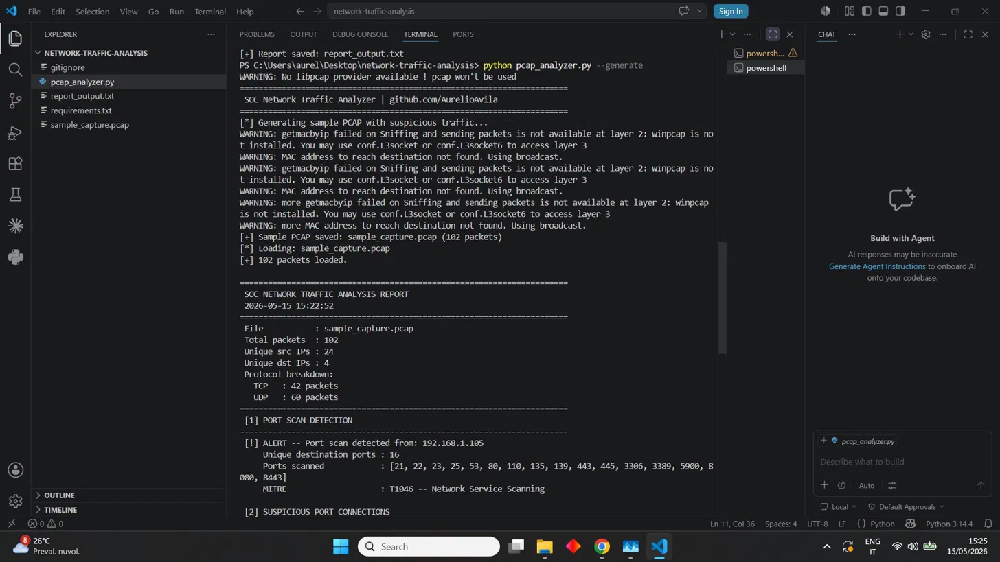
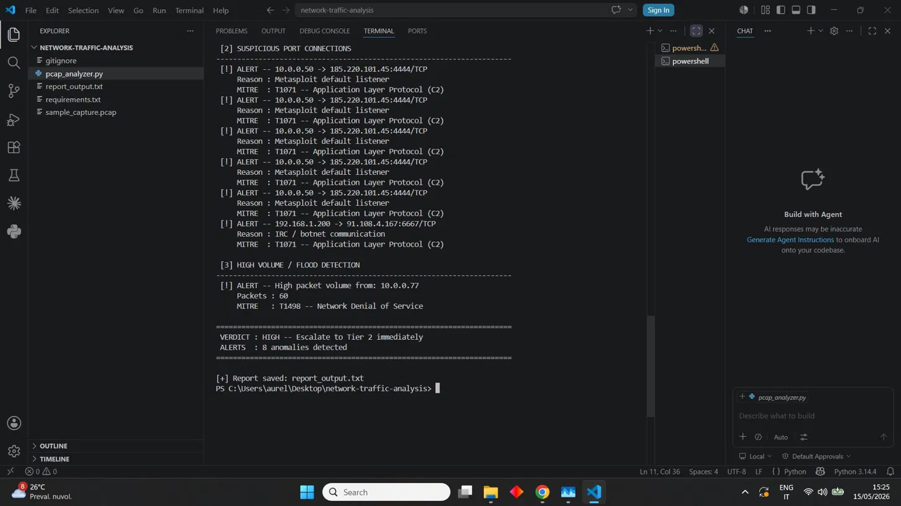

# Network Traffic Analysis — SOC Home Lab

A Tier 1 SOC analyst workflow for analyzing network packet captures (PCAP),
detecting suspicious traffic patterns, and generating structured incident reports.

> **Note:** This is a home-lab portfolio project. The sample PCAP is generated
> synthetically for demonstration purposes.

---

## Scenario

A suspicious traffic alert was raised on the network. The analyst performs
a full packet capture analysis to identify:

- Active port scans against internal hosts
- Connections to known malicious or suspicious ports (C2 channels)
- High-volume UDP floods indicating potential DoS activity

## Workflow

1. Generate or load a PCAP file with network traffic
2. Parse all packets and extract source/destination IPs, ports, and protocols
3. Apply detection logic: port scan, suspicious ports, high-volume flood
4. Enrich findings with MITRE ATT&CK technique mapping
5. Produce a structured verdict report

---

## 🎯 MITRE ATT&CK Mapping

| Technique | ID | Tactic |
|-----------|-----|--------|
| Network Service Scanning | [T1046](https://attack.mitre.org/techniques/T1046/) | Discovery (TA0007) |
| Application Layer Protocol (C2) | [T1071](https://attack.mitre.org/techniques/T1071/) | Command and Control (TA0011) |
| Network Denial of Service | [T1498](https://attack.mitre.org/techniques/T1498/) | Impact (TA0040) |

---

## Tools

- **Python 3** — packet parsing and detection logic
- **Scapy** — PCAP generation and analysis
- **argparse** — CLI interface

## Detection Logic

**Port scan detection:**
- Flags any source IP hitting 10+ unique destination ports
- Maps to T1046 — Network Service Scanning

**Suspicious port detection:**
- Monitors connections to known malicious ports:
  `4444` (Metasploit), `1337` (backdoor), `6667` (IRC/botnet),
  `6666`, `31337`, `9001` (Tor), `9050` (Tor SOCKS), `8888` (C2)
- Maps to T1071 — Application Layer Protocol

**High volume / flood detection:**
- Flags any source IP sending 50+ packets
- Maps to T1498 — Network Denial of Service

## Repository Structure

    network-traffic-analysis/
    ├── pcap_analyzer.py       # main analysis and detection script
    ├── sample_capture.pcap    # synthetically generated suspicious traffic
    ├── report_output.txt      # sample report output
    ├── requirements.txt       # Python dependencies
    ├── .gitignore
    └── README.md

## Setup

### 1. Clone the repository

```bash
git clone https://github.com/AurelioAvila/network-traffic-analysis.git
cd network-traffic-analysis
```

### 2. Install dependencies

```bash
python -m pip install scapy
```

### 3. Generate sample PCAP and analyze

```bash
python pcap_analyzer.py --generate
```

### 4. Analyze an existing PCAP

```bash
python pcap_analyzer.py your_capture.pcap
```

### 5. Custom output file

```bash
python pcap_analyzer.py --generate --output my_report.txt
```

---

## 📸 Screenshots

**Part 1 — Traffic summary and port scan detection:**


**Part 2 — C2 connections, flood detection and verdict:**


---

## Sample Output

```
======================================================================
 SOC NETWORK TRAFFIC ANALYSIS REPORT
 2026-05-15 15:22:52
======================================================================
 File           : sample_capture.pcap
 Total packets  : 102
 Unique src IPs : 24
 Unique dst IPs : 4
 Protocol breakdown:
   TCP   : 42 packets
   UDP   : 60 packets
======================================================================
 [1] PORT SCAN DETECTION
----------------------------------------------------------------------
 [!] ALERT -- Port scan detected from: 192.168.1.105
     Unique destination ports : 16
     Ports scanned            : [21, 22, 23, 25, 53, 80, 110, 135, 139, 443, 445, 3306, 3389, 5900, 8080, 8443]
     MITRE                    : T1046 -- Network Service Scanning

 [2] SUSPICIOUS PORT CONNECTIONS
----------------------------------------------------------------------
 [!] ALERT -- 10.0.0.50 -> 185.220.101.45:4444/TCP
     Reason : Metasploit default listener
     MITRE  : T1071 -- Application Layer Protocol (C2)
 [!] ALERT -- 192.168.1.200 -> 91.108.4.167:6667/TCP
     Reason : IRC / botnet communication
     MITRE  : T1071 -- Application Layer Protocol (C2)

 [3] HIGH VOLUME / FLOOD DETECTION
----------------------------------------------------------------------
 [!] ALERT -- High packet volume from: 10.0.0.77
     Packets : 60
     MITRE   : T1498 -- Network Denial of Service
======================================================================
 VERDICT : HIGH -- Escalate to Tier 2 immediately
 ALERTS  : 8 anomalies detected
======================================================================
```

---

## Disclaimer

This project is for educational and portfolio purposes only.
The sample PCAP is synthetically generated. This tool must never be used
against networks or systems for which you do not have explicit authorization.

---

## 🔗 Related Projects

| Project | Description |
|---------|-------------|
| [soc-home-lab](https://github.com/AurelioAvila/soc-home-lab) | End-to-end SOC lab with Microsoft Sentinel and Wazuh |
| [malware-triage-hash](https://github.com/AurelioAvila/malware-triage-hash) | Python tool for malware triage via VirusTotal API |
| [phishing-email-analysis](https://github.com/AurelioAvila/phishing-email-analysis) | Email header parser and IOC extractor |
| [splunk-brute-force-detection](https://github.com/AurelioAvila/splunk-brute-force-detection) | Brute force detection with Splunk SPL |
